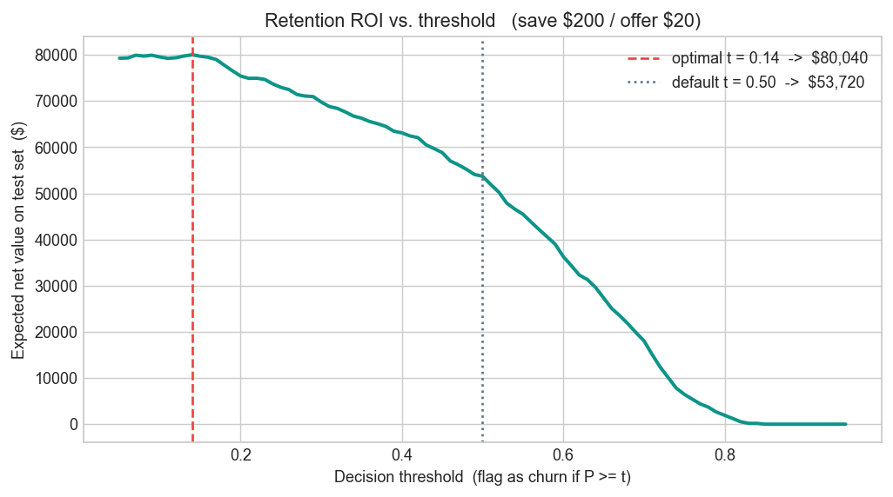

# Telco Customer Churn — Analysis & Prediction

Predicting telecom customer churn and turning the drivers into a retention-targeting
view. A product-analytics project: **business question first, model as a tool.**

## Headline results

- **Who churns:** month-to-month contracts (43%), electronic-check payers (45%), and
  fiber-optic internet (42%) are the highest-risk segments; two-year contracts barely
  churn (3%).
- **Catching churners:** a class-balanced model flags ~80% of churners vs. 56% for a
  default logistic model — at the cost of more false alarms.
- **The real lever is the decision threshold, not the algorithm.** The strong models
  *rank* churners similarly (AUC ≈ 0.82–0.85; a single unpruned tree is the exception at
  0.66). Moving the cutoff from the naive 0.50 to the value-maximizing 0.14 is worth
  **~$26K** of expected net value on the 2,113-customer test set — same model, same data.

## Dataset

IBM Telco Customer Churn — 7,043 customers × 21 fields (contract, tenure, charges,
services, churn flag). Public sample dataset, included in `data/`.

## Approach

| Stage | State |
|---|---|
| Data cleaning (`TotalCharges` → numeric, NaNs) | ✅ |
| EDA — churn rate by contract / tenure / charges / payment | ✅ |
| Encoding + stratified train/test split | ✅ |
| Logistic-regression baseline | ✅ |
| Decision Tree / Random Forest / XGBoost + comparison | ✅ |
| Evaluation beyond accuracy (precision / recall / ROC-AUC) | ✅ |
| Churn drivers + retention-ROI decision framing | ✅ |

## Model comparison (test set = 2,113 customers)

Metrics are computed from the fitted models in the notebook — not hand-typed. *Churn* is the positive class.

| Model | Churn recall | Churn precision | F1 | Accuracy | ROC-AUC |
|---|:---:|:---:|:---:|:---:|:---:|
| Logistic Regression | 0.56 | 0.67 | 0.61 | 0.81 | 0.845 |
| Logistic Regression (balanced) | **0.80** | 0.51 | 0.62 | 0.74 | 0.844 |
| Decision Tree (single, unpruned) | 0.50 | 0.50 | 0.50 | 0.73 | 0.659 |
| Random Forest | 0.49 | 0.62 | 0.55 | 0.79 | 0.822 |
| XGBoost (`scale_pos_weight=2.8`) | 0.67 | 0.53 | 0.59 | 0.76 | 0.815 |

*5-fold stratified CV confirms the ranking is stable: Logistic Regression 0.845 ± 0.013, Random Forest 0.825 ± 0.012, XGBoost 0.822 ± 0.011.* The lone unpruned Decision Tree (AUC 0.66) is the outlier — which is exactly why we reach for ensembles.

## The decision is the threshold — and it's worth real money



The model only *ranks* customers; the business decides *where to cut*. At **$200 per save / $20 per offer**, the value-maximizing cutoff is **t ≈ 0.14**, not the default 0.50 — worth **+$26,320** of expected net value on the test set (**$80,040 vs. $53,720**):

> **Net value = (churners caught × value of a save) − (everyone flagged × cost of an offer)**

## Next steps

- Behavioral features (recent usage drop, support tickets, tenure milestones)
- **Calibrate** the predicted probabilities so the dollar curve reflects true risk
- Validate the chosen decision threshold against real offer economics

## Run

```bash
pip install -r requirements.txt
jupyter lab notebooks/03_churn_classification.ipynb
```
